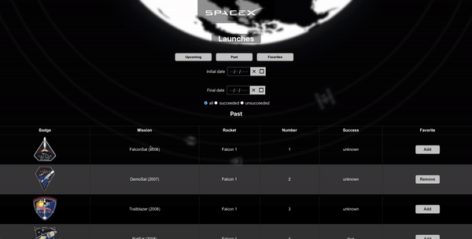

## SpaceX Launches List

[![LinkedIn-Designer][linkedin-shield]][linkedin-url-1]

<!-- PROJECT LOGO -->
<br />
<p align="center">
  <a href="https://github.com/Toshiuk/bips-front">
  
</a>
  <p align="center">
      "You want to wake up in the morning and think the future is going to be great - and that’s what being a spacefaring civilization is all about. It’s about believing in the future and thinking that the future will be better than the past. And I can’t think of anything more exciting than going out there and being among the stars.” <br>- Elon Musk
    <br />
    <br />
    <a href="https://themathpires.github.io/SpaceX-Launches/" target="_blank">View Demo</a>
  </p>
</p>

<!-- TABLE OF CONTENTS -->

## Table of Contents

- [About the Project](#about-the-project)
  - [Built With](#built-with)
- [Getting Started](#getting-started)
  - [Prerequisites](#prerequisites)
  - [Running](#running)

<!-- ABOUT THE PROJECT -->

## About The Project
Application that queries the SpaceX API, returning all past and upcoming launches. It is possible to do a personalized search and consult information such as mission status, used rocket, mission year, his badge and also the feature to add to favorites.

<p align="center">
  
</p>

### Built With

- [React](https://reactjs.org/)
- [Emotion](https://emotion.sh/)

<!-- GETTING STARTED -->

## Getting Started

### Prerequisites

- node
- npm
- yarn

### Running

1. Clone the repo

```sh
git clone https://github.com/TheMathPires/SpaceX-Launches.git
```

2. Install NPM packages

```sh
npm install
```

3. Run development mode

```sh
npm start
```

<!-- MARKDOWN LINKS & IMAGES -->

[linkedin-shield]: https://img.shields.io/badge/-LinkedIn-black.svg?style=flat-square&logo=linkedin&colorB=555
[linkedin-url-1]: https://www.linkedin.com/in/themathpires/